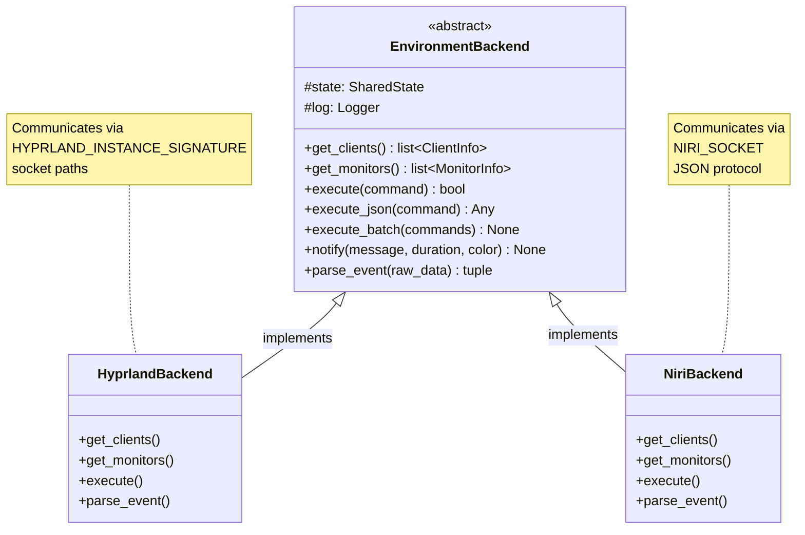

# Core Components

This document details the core components of Pyprland's architecture.

## Entry Points

The application can run in two modes: **daemon** (background service) or **client** (send commands to running daemon).

```mermaid
flowchart LR
    main(["🚀 main()"]) --> detect{"❓ Args?"}
    detect -->|No arguments| daemon["🔧 run_daemon()"]
    detect -->|Command given| client["📤 run_client()"]
    daemon --> Pyprland(["⚙️ Pyprland().run()"])
    client --> socket(["📡 Send via socket"])
    Pyprland --> events["📨 Listen for events"]
    socket --> response(["✅ Receive response"])

    style main fill:#7fb3d3,stroke:#5a8fa8,color:#000
    style detect fill:#d4c875,stroke:#a89a50,color:#000
    style daemon fill:#8fbc8f,stroke:#6a9a6a,color:#000
    style client fill:#8fbc8f,stroke:#6a9a6a,color:#000
    style Pyprland fill:#d4a574,stroke:#a67c50,color:#000
    style socket fill:#d4a574,stroke:#a67c50,color:#000
```



| Entry Point | File | Purpose |
|-------------|------|---------|
| `pypr` | [`command.py`](https://github.com/fdev31/pyprland/blob/main/pyprland/command.py) | Main CLI entry (daemon or client mode) |
| Daemon mode | [`pypr_daemon.py`](https://github.com/fdev31/pyprland/blob/main/pyprland/pypr_daemon.py) | Start the background daemon |
| Client mode | [`client.py`](https://github.com/fdev31/pyprland/blob/main/pyprland/client.py) | Send command to running daemon |

## Manager

The [`Pyprland`](https://github.com/fdev31/pyprland/blob/main/pyprland/manager.py) class is the core orchestrator, responsible for:

| Responsibility | Method/Attribute |
|----------------|------------------|
| Plugin loading | `_load_plugins()` |
| Event dispatching | `_run_event()` |
| Command handling | `handle_command()` |
| Server lifecycle | `run()`, `serve()` |
| Configuration | `load_config()`, `config` |
| Shared state | `state: SharedState` |

**Key Design Patterns:**

- **Per-plugin async task queues** (`queues: dict[str, asyncio.Queue]`) - ensures plugin isolation
- **Deduplication** via `@remove_duplicate` decorator - prevents rapid duplicate events
- **Plugin isolation** - each plugin processes events independently

## Plugin System

### Base Class

All plugins inherit from the [`Plugin`](https://github.com/fdev31/pyprland/blob/main/pyprland/plugins/interface.py) base class:

```python
class Plugin:
    name: str                    # Plugin identifier
    config: Configuration        # Plugin-specific config section
    state: SharedState           # Shared application state
    backend: EnvironmentBackend  # WM abstraction layer
    log: Logger                  # Plugin-specific logger
    
    # Lifecycle hooks
    async def init() -> None           # Called once at startup
    async def on_reload() -> None      # Called on init and config reload
    async def exit() -> None           # Called on shutdown
    
    # Config validation
    config_schema: ClassVar[list[ConfigField]]
    def validate_config() -> list[str]
```

### Event Handler Protocol

Plugins implement handlers by naming convention. See [`protocols.py`](https://github.com/fdev31/pyprland/blob/main/pyprland/plugins/protocols.py) for the full protocol definitions:

```python
# Hyprland events: event_<eventname>
async def event_openwindow(self, params: str) -> None: ...
async def event_closewindow(self, addr: str) -> None: ...
async def event_workspace(self, workspace: str) -> None: ...

# Commands: run_<command>
async def run_toggle(self, name: str) -> str | None: ...

# Niri events: niri_<eventtype>
async def niri_outputschanged(self, data: dict) -> None: ...
```

### Plugin Lifecycle

```mermaid
sequenceDiagram
    autonumber
    participant M as ⚙️ Manager
    participant P as 🔌 Plugin
    participant C as 📄 Config

    rect rgba(143, 188, 143, 0.2)
        Note over M,C: Initialization Phase
        M->>P: __init__(name)
        M->>P: init()
        M->>C: load TOML config
        C-->>M: config data
        M->>P: load_config(config)
        M->>P: validate_config()
        P-->>M: validation errors (if any)
        M->>P: on_reload()
    end
    
    rect rgba(127, 179, 211, 0.2)
        Note over M,P: Runtime Phase
        loop Events from WM
            M->>P: event_*(data)
            P-->>M: (async processing)
        end
        
        loop Commands from User
            M->>P: run_*(args)
            P-->>M: result
        end
    end
    
    rect rgba(212, 165, 116, 0.2)
        Note over M,P: Shutdown Phase
        M->>P: exit()
        P-->>M: cleanup complete
    end
```



### Built-in Plugins

| Plugin | Source | Description |
|--------|--------|-------------|
| `pyprland` (core) | [`plugins/pyprland/`](https://github.com/fdev31/pyprland/tree/main/pyprland/plugins/pyprland) | Internal state management |
| `scratchpads` | [`plugins/scratchpads/`](https://github.com/fdev31/pyprland/tree/main/pyprland/plugins/scratchpads) | Dropdown/scratchpad windows |
| `monitors` | [`plugins/monitors/`](https://github.com/fdev31/pyprland/tree/main/pyprland/plugins/monitors) | Monitor layout management |
| `wallpapers` | [`plugins/wallpapers/`](https://github.com/fdev31/pyprland/tree/main/pyprland/plugins/wallpapers) | Wallpaper cycling, color schemes |
| `expose` | [`plugins/expose.py`](https://github.com/fdev31/pyprland/blob/main/pyprland/plugins/expose.py) | Window overview |
| `magnify` | [`plugins/magnify.py`](https://github.com/fdev31/pyprland/blob/main/pyprland/plugins/magnify.py) | Zoom functionality |
| `layout_center` | [`plugins/layout_center.py`](https://github.com/fdev31/pyprland/blob/main/pyprland/plugins/layout_center.py) | Centered layout mode |
| `fetch_client_menu` | [`plugins/fetch_client_menu.py`](https://github.com/fdev31/pyprland/blob/main/pyprland/plugins/fetch_client_menu.py) | Menu-based window switching |
| `shortcuts_menu` | [`plugins/shortcuts_menu.py`](https://github.com/fdev31/pyprland/blob/main/pyprland/plugins/shortcuts_menu.py) | Shortcut launcher |
| `toggle_dpms` | [`plugins/toggle_dpms.py`](https://github.com/fdev31/pyprland/blob/main/pyprland/plugins/toggle_dpms.py) | Screen power toggle |
| `toggle_special` | [`plugins/toggle_special.py`](https://github.com/fdev31/pyprland/blob/main/pyprland/plugins/toggle_special.py) | Special workspace toggle |
| `system_notifier` | [`plugins/system_notifier.py`](https://github.com/fdev31/pyprland/blob/main/pyprland/plugins/system_notifier.py) | System notifications |
| `lost_windows` | [`plugins/lost_windows.py`](https://github.com/fdev31/pyprland/blob/main/pyprland/plugins/lost_windows.py) | Recover lost windows |
| `shift_monitors` | [`plugins/shift_monitors.py`](https://github.com/fdev31/pyprland/blob/main/pyprland/plugins/shift_monitors.py) | Shift windows between monitors |
| `workspaces_follow_focus` | [`plugins/workspaces_follow_focus.py`](https://github.com/fdev31/pyprland/blob/main/pyprland/plugins/workspaces_follow_focus.py) | Workspace follows focus |
| `fcitx5_switcher` | [`plugins/fcitx5_switcher.py`](https://github.com/fdev31/pyprland/blob/main/pyprland/plugins/fcitx5_switcher.py) | Input method switching |
| `menubar` | [`plugins/menubar.py`](https://github.com/fdev31/pyprland/blob/main/pyprland/plugins/menubar.py) | Menu bar integration |

## Backend Adapter Layer

The adapter layer abstracts differences between window managers. See [`adapters/`](https://github.com/fdev31/pyprland/tree/main/pyprland/adapters) for the full implementation.



| Class | Source |
|-------|--------|
| `EnvironmentBackend` | [`adapters/backend.py`](https://github.com/fdev31/pyprland/blob/main/pyprland/adapters/backend.py) |
| `HyprlandBackend` | [`adapters/hyprland.py`](https://github.com/fdev31/pyprland/blob/main/pyprland/adapters/hyprland.py) |
| `NiriBackend` | [`adapters/niri.py`](https://github.com/fdev31/pyprland/blob/main/pyprland/adapters/niri.py) |

The backend is selected automatically based on environment:
- If `NIRI_SOCKET` is set -> `NiriBackend`
- Otherwise -> `HyprlandBackend`

## IPC Layer

Low-level socket communication with the window manager is handled in [`ipc.py`](https://github.com/fdev31/pyprland/blob/main/pyprland/ipc.py):

| Function | Purpose |
|----------|---------|
| `hyprctl_connection()` | Context manager for Hyprland command socket |
| `niri_connection()` | Context manager for Niri socket |
| `get_response()` | Send command, receive JSON response |
| `get_event_stream()` | Subscribe to WM event stream |
| `niri_request()` | Send Niri-specific request |
| `@retry_on_reset` | Decorator for automatic connection retry |

**Socket Paths:**

| Socket | Path |
|--------|------|
| Hyprland commands | `$XDG_RUNTIME_DIR/hypr/$SIGNATURE/.socket.sock` |
| Hyprland events | `$XDG_RUNTIME_DIR/hypr/$SIGNATURE/.socket2.sock` |
| Niri | `$NIRI_SOCKET` |
| Pyprland (Hyprland) | `$XDG_RUNTIME_DIR/hypr/$SIGNATURE/.pyprland.sock` |
| Pyprland (Niri) | `dirname($NIRI_SOCKET)/.pyprland.sock` |
| Pyprland (standalone) | `$XDG_DATA_HOME/.pyprland.sock` |

## Pyprland Socket Protocol

The daemon exposes a Unix domain socket for client-daemon communication. This simple text-based protocol allows any language to implement a client.

### Socket Path

The socket location depends on the environment:

| Environment | Socket Path |
|-------------|-------------|
| Hyprland | `$XDG_RUNTIME_DIR/hypr/$HYPRLAND_INSTANCE_SIGNATURE/.pyprland.sock` |
| Niri | `dirname($NIRI_SOCKET)/.pyprland.sock` |
| Standalone | `$XDG_DATA_HOME/.pyprland.sock` (defaults to `~/.local/share/.pyprland.sock`) |

If the Hyprland path exceeds 107 characters, a shortened path is used:

```
/tmp/.pypr-$HYPRLAND_INSTANCE_SIGNATURE/.pyprland.sock
```

### Protocol

```mermaid
sequenceDiagram
    autonumber
    participant Client as 💻 Client
    participant Socket as 📡 Unix Socket
    participant Daemon as ⚙️ Daemon

    rect rgba(127, 179, 211, 0.2)
        Note over Client,Socket: Request
        Client->>Socket: Connect
        Client->>Socket: "command args\n"
        Client->>Socket: EOF (shutdown write)
    end

    rect rgba(143, 188, 143, 0.2)
        Note over Socket,Daemon: Processing
        Socket->>Daemon: read_command()
        Daemon->>Daemon: Execute command
    end

    rect rgba(212, 165, 116, 0.2)
        Note over Daemon,Client: Response
        Daemon->>Socket: "OK\n" or "ERROR: msg\n"
        Socket->>Client: Read until EOF
        Client->>Client: Parse & exit
    end
```



| Direction | Format |
|-----------|--------|
| **Request** | `<command> [args...]\n` (newline-terminated, then EOF) |
| **Response** | `OK [output]` or `ERROR: <message>` or raw text (legacy) |

**Response Prefixes:**

| Prefix | Meaning | Exit Code |
|--------|---------|-----------|
| `OK` | Command succeeded | 0 |
| `OK <output>` | Command succeeded with output | 0 |
| `ERROR: <msg>` | Command failed | 4 |
| *(raw text)* | Legacy response (help, version, dumpjson) | 0 |

**Exit Codes:**

| Code | Name | Description |
|------|------|-------------|
| 0 | SUCCESS | Command completed successfully |
| 1 | USAGE_ERROR | No command provided or invalid arguments |
| 2 | ENV_ERROR | Missing environment variables |
| 3 | CONNECTION_ERROR | Cannot connect to daemon |
| 4 | COMMAND_ERROR | Command execution failed |

See [`models.py`](https://github.com/fdev31/pyprland/blob/main/pyprland/models.py) for `ExitCode` and `ResponsePrefix` definitions.

## pypr-client {#pypr-client}

For performance-critical use cases (e.g., keybindings), `pypr-client` is a lightweight C client available as an alternative to `pypr`. It supports all commands except `validate` and `edit` (which require Python).

| File | Description |
|------|-------------|
| [`client/pypr-client.c`](https://github.com/fdev31/pyprland/blob/main/client/pypr-client.c) | C implementation of the pypr client |

**Build:**

```bash
cd client
gcc -O2 -o pypr-client pypr-client.c
```

**Features:**

- Minimal dependencies (libc only)
- Fast startup (~1ms vs ~50ms for Python)
- Same protocol as Python client
- Proper exit codes for scripting

**Comparison:**

| Aspect | `pypr` | `pypr-client` |
|--------|--------|---------------|
| Startup time | ~50ms | ~1ms |
| Dependencies | Python 3.11+ | libc |
| Daemon mode | Yes | No |
| Commands | All | All except `validate`, `edit` |
| Best for | Interactive use, daemon | Keybindings |
| Source | [`client.py`](https://github.com/fdev31/pyprland/blob/main/pyprland/client.py) | [`pypr-client.c`](https://github.com/fdev31/pyprland/blob/main/client/pypr-client.c) |

## Configuration System

Configuration is stored in TOML format at `~/.config/pypr/config.toml`:

```toml
[pyprland]
plugins = ["scratchpads", "monitors", "magnify"]

[scratchpads.term]
command = "kitty --class scratchpad"
position = "50% 50%"
size = "80% 80%"

[monitors]
unknown = "extend"
```

| Component | Source | Description |
|-----------|--------|-------------|
| `Configuration` | [`config.py`](https://github.com/fdev31/pyprland/blob/main/pyprland/config.py) | Dict wrapper with typed accessors |
| `ConfigValidator` | [`validation.py`](https://github.com/fdev31/pyprland/blob/main/pyprland/validation.py) | Schema-based validation |
| `ConfigField` | [`validation.py`](https://github.com/fdev31/pyprland/blob/main/pyprland/validation.py) | Field definition (name, type, required, default) |

## Shared State

The [`SharedState`](https://github.com/fdev31/pyprland/blob/main/pyprland/common.py) dataclass maintains commonly needed information:

```python
@dataclass
class SharedState:
    active_workspace: str    # Current workspace name
    active_monitor: str      # Current monitor name  
    active_window: str       # Current window address
    environment: str         # "hyprland" or "niri"
    variables: dict          # User-defined variables
    monitors: list[str]      # All monitor names
    hyprland_version: VersionInfo
```

## Data Models

TypedDict definitions in [`models.py`](https://github.com/fdev31/pyprland/blob/main/pyprland/models.py) ensure type safety:

```python
class ClientInfo(TypedDict):
    address: str
    mapped: bool
    hidden: bool
    workspace: WorkspaceInfo
    class_: str  # aliased from "class"
    title: str
    # ... more fields

class MonitorInfo(TypedDict):
    name: str
    width: int
    height: int
    x: int
    y: int
    focused: bool
    transform: int
    # ... more fields
```
