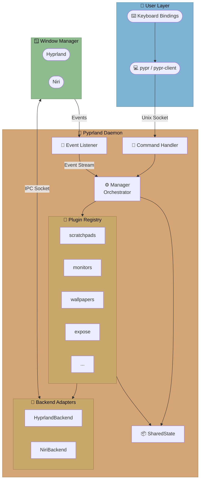
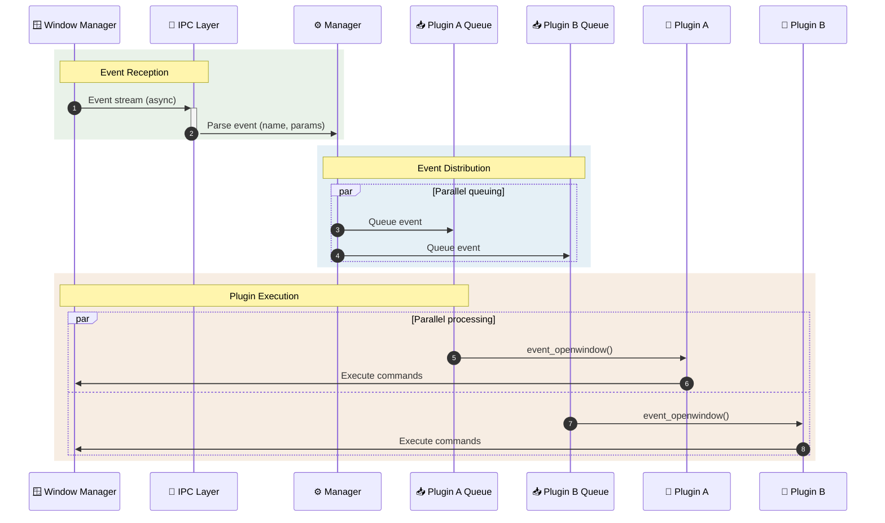
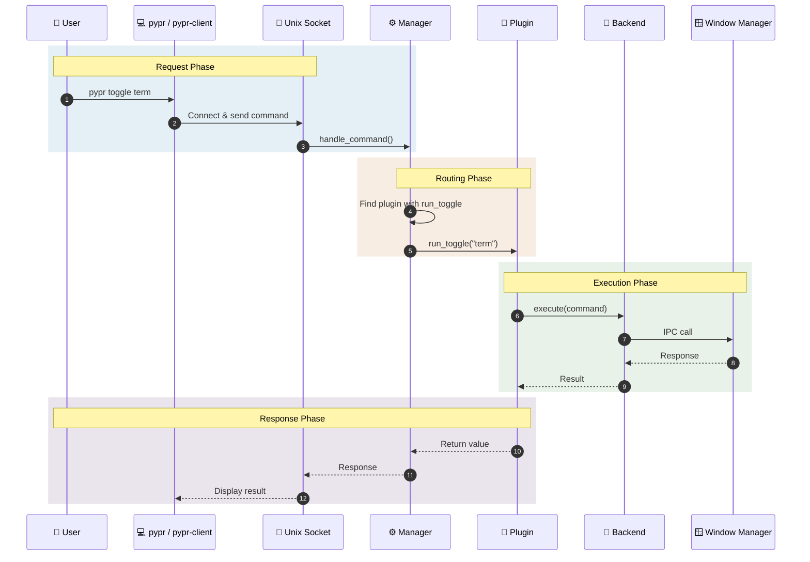

# Architecture Overview

This document provides a high-level overview of Pyprland's architecture, data flow, and design patterns.

> [!tip]
> For a practical guide to writing plugins, see the [Development](./Development) document.

## Executive Summary

**Pyprland** is a plugin-based companion application for tiling window managers (Hyprland, Niri). It operates as a daemon that extends the window manager's capabilities through a modular plugin system, communicating via Unix domain sockets (IPC).

| Attribute | Value |
|-----------|-------|
| Language | Python 3.11+ |
| License | MIT |
| Architecture | Daemon/Client, Plugin-based |
| Async Framework | asyncio |

## High-Level Architecture



## Data Flow

### Event Processing

When the window manager emits an event (window opened, workspace changed, etc.):



### Command Processing

When the user runs `pypr <command>`:



## Directory Structure

All source files are in the [`pyprland/`](https://github.com/fdev31/pyprland/tree/main/pyprland) directory:

```
pyprland/
├── command.py           # CLI entry point, argument parsing
├── pypr_daemon.py       # Daemon startup logic
├── manager.py           # Core Pyprland class (orchestrator)
├── client.py            # Client mode implementation
├── ipc.py               # Socket communication with WM
├── config.py            # Configuration wrapper
├── validation.py        # Config validation framework
├── common.py            # Shared utilities, SharedState, logging
├── constants.py         # Global constants
├── models.py            # TypedDict definitions
├── version.py           # Version string
├── aioops.py            # Async file ops, DebouncedTask
├── completions.py       # Shell completion generators
├── help.py              # Help system
├── ansi.py              # Terminal colors/styling
├── debug.py             # Debug utilities
│
├── adapters/            # Window manager abstraction
│   ├── backend.py       # Abstract EnvironmentBackend
│   ├── hyprland.py      # Hyprland implementation
│   ├── niri.py          # Niri implementation
│   ├── menus.py         # Menu engine abstraction (rofi, wofi, etc.)
│   └── units.py         # Unit conversion utilities
│
└── plugins/             # Plugin implementations
    ├── interface.py     # Plugin base class
    ├── protocols.py     # Event handler protocols
    │
    ├── pyprland/        # Core internal plugin
    ├── scratchpads/     # Scratchpad plugin (complex, multi-file)
    ├── monitors/        # Monitor management
    ├── wallpapers/      # Wallpaper management
    │
    └── *.py             # Simple single-file plugins
```

## Design Patterns

| Pattern | Usage |
|---------|-------|
| **Plugin Architecture** | Extensibility via [`Plugin`](https://github.com/fdev31/pyprland/blob/main/pyprland/plugins/interface.py) base class |
| **Adapter Pattern** | [`EnvironmentBackend`](https://github.com/fdev31/pyprland/blob/main/pyprland/adapters/backend.py) abstracts WM differences |
| **Strategy Pattern** | Menu engines in [`menus.py`](https://github.com/fdev31/pyprland/blob/main/pyprland/adapters/menus.py) (rofi, wofi, tofi, etc.) |
| **Observer Pattern** | Event handlers subscribe to WM events |
| **Async Task Queues** | Per-plugin isolation, prevents blocking |
| **Decorator Pattern** | `@retry_on_reset` in [`ipc.py`](https://github.com/fdev31/pyprland/blob/main/pyprland/ipc.py), `@remove_duplicate` in [`manager.py`](https://github.com/fdev31/pyprland/blob/main/pyprland/manager.py) |
| **Template Method** | Plugin lifecycle hooks (`init`, `on_reload`, `exit`) |
