# Architecture Overview

This document provides a high-level overview of Pyprland's architecture, data flow, and design patterns.

> [!tip]
> For a practical guide to writing plugins, see the [Development](./Development) document.

## Executive Summary

**Pyprland** is a plugin-based companion application for tiling window managers (Hyprland, Niri). It operates as a daemon that extends the window manager's capabilities through a modular plugin system, communicating via Unix domain sockets (IPC).

| Attribute | Value |
|-----------|-------|
| Language | Python 3.11+ |
| License | MIT |
| Architecture | Daemon/Client, Plugin-based |
| Async Framework | asyncio |

## High-Level Architecture

```mermaid
flowchart TB
    subgraph User["👤 User Layer"]
        KB(["⌨️ Keyboard Bindings"])
        CLI(["💻 pypr / pypr-client"])
    end

    subgraph Pyprland["🔶 Pyprland Daemon"]
        direction TB
        CMD["🎯 Command Handler"]
        EVT["📨 Event Listener"]
        
        subgraph Plugins["🔌 Plugin Registry"]
            P1["scratchpads"]
            P2["monitors"]
            P3["wallpapers"]
            P4["expose"]
            P5["..."]
        end
        
        subgraph Adapters["🔄 Backend Adapters"]
            HB["HyprlandBackend"]
            NB["NiriBackend"]
        end
        
        MGR["⚙️ Manager<br/>Orchestrator"]
        STATE["📦 SharedState"]
    end

    subgraph WM["🪟 Window Manager"]
        HYPR(["Hyprland"])
        NIRI(["Niri"])
    end

    KB --> CLI
    CLI -->|Unix Socket| CMD
    CMD --> MGR
    MGR --> Plugins
    Plugins --> Adapters
    EVT -->|Event Stream| MGR
    Adapters <-->|IPC Socket| WM
    WM -->|Events| EVT
    MGR --> STATE
    Plugins --> STATE

    style User fill:#7fb3d3,stroke:#5a8fa8,color:#000
    style Pyprland fill:#d4a574,stroke:#a67c50,color:#000
    style WM fill:#8fbc8f,stroke:#6a9a6a,color:#000
    style Plugins fill:#c9a86c,stroke:#9a7a4a,color:#000
    style Adapters fill:#c9a86c,stroke:#9a7a4a,color:#000
```



## Data Flow

### Event Processing

When the window manager emits an event (window opened, workspace changed, etc.):

```mermaid
sequenceDiagram
    autonumber
    participant WM as 🪟 Window Manager
    participant IPC as 📡 IPC Layer
    participant MGR as ⚙️ Manager
    participant Q1 as 📥 Plugin A Queue
    participant Q2 as 📥 Plugin B Queue
    participant P1 as 🔌 Plugin A
    participant P2 as 🔌 Plugin B

    rect rgba(143, 188, 143, 0.2)
        Note over WM,IPC: Event Reception
        WM->>+IPC: Event stream (async)
        IPC->>-MGR: Parse event (name, params)
    end

    rect rgba(127, 179, 211, 0.2)
        Note over MGR,Q2: Event Distribution
        par Parallel queuing
            MGR->>Q1: Queue event
            MGR->>Q2: Queue event
        end
    end

    rect rgba(212, 165, 116, 0.2)
        Note over Q1,WM: Plugin Execution
        par Parallel processing
            Q1->>P1: event_openwindow()
            P1->>WM: Execute commands
        and
            Q2->>P2: event_openwindow()
            P2->>WM: Execute commands
        end
    end
```



### Command Processing

```mermaid
sequenceDiagram
    autonumber
    participant User as 👤 User
    participant CLI as 💻 pypr / pypr-client
    participant Socket as 📡 Unix Socket
    participant MGR as ⚙️ Manager
    participant Plugin as 🔌 Plugin
    participant Backend as 🔄 Backend
    participant WM as 🪟 Window Manager

    rect rgba(127, 179, 211, 0.2)
        Note over User,Socket: Request Phase
        User->>CLI: pypr toggle term
        CLI->>Socket: Connect & send command
        Socket->>MGR: handle_command()
    end

    rect rgba(212, 165, 116, 0.2)
        Note over MGR,Plugin: Routing Phase
        MGR->>MGR: Find plugin with run_toggle
        MGR->>Plugin: run_toggle("term")
    end

    rect rgba(143, 188, 143, 0.2)
        Note over Plugin,WM: Execution Phase
        Plugin->>Backend: execute(command)
        Backend->>WM: IPC call
        WM-->>Backend: Response
        Backend-->>Plugin: Result
    end

    rect rgba(150, 120, 160, 0.2)
        Note over Plugin,User: Response Phase
        Plugin-->>MGR: Return value
        MGR-->>Socket: Response
        Socket-->>CLI: Display result
    end
```

When the user runs `pypr <command>`:



## Directory Structure

All source files are in the [`pyprland/`](https://github.com/fdev31/pyprland/tree/main/pyprland) directory:

```
pyprland/
├── command.py           # CLI entry point, argument parsing
├── pypr_daemon.py       # Daemon startup logic
├── manager.py           # Core Pyprland class (orchestrator)
├── client.py            # Client mode implementation
├── ipc.py               # Socket communication with WM
├── config.py            # Configuration wrapper
├── validation.py        # Config validation framework
├── common.py            # Shared utilities, SharedState, logging
├── constants.py         # Global constants
├── models.py            # TypedDict definitions
├── version.py           # Version string
├── aioops.py            # Async file ops, DebouncedTask
├── completions.py       # Shell completion generators
├── help.py              # Help system
├── ansi.py              # Terminal colors/styling
├── debug.py             # Debug utilities
│
├── adapters/            # Window manager abstraction
│   ├── backend.py       # Abstract EnvironmentBackend
│   ├── hyprland.py      # Hyprland implementation
│   ├── niri.py          # Niri implementation
│   ├── menus.py         # Menu engine abstraction (rofi, wofi, etc.)
│   └── units.py         # Unit conversion utilities
│
└── plugins/             # Plugin implementations
    ├── interface.py     # Plugin base class
    ├── protocols.py     # Event handler protocols
    │
    ├── pyprland/        # Core internal plugin
    ├── scratchpads/     # Scratchpad plugin (complex, multi-file)
    ├── monitors/        # Monitor management
    ├── wallpapers/      # Wallpaper management
    │
    └── *.py             # Simple single-file plugins
```

## Design Patterns

| Pattern | Usage |
|---------|-------|
| **Plugin Architecture** | Extensibility via [`Plugin`](https://github.com/fdev31/pyprland/blob/main/pyprland/plugins/interface.py) base class |
| **Adapter Pattern** | [`EnvironmentBackend`](https://github.com/fdev31/pyprland/blob/main/pyprland/adapters/backend.py) abstracts WM differences |
| **Strategy Pattern** | Menu engines in [`menus.py`](https://github.com/fdev31/pyprland/blob/main/pyprland/adapters/menus.py) (rofi, wofi, tofi, etc.) |
| **Observer Pattern** | Event handlers subscribe to WM events |
| **Async Task Queues** | Per-plugin isolation, prevents blocking |
| **Decorator Pattern** | `@retry_on_reset` in [`ipc.py`](https://github.com/fdev31/pyprland/blob/main/pyprland/ipc.py), `@remove_duplicate` in [`manager.py`](https://github.com/fdev31/pyprland/blob/main/pyprland/manager.py) |
| **Template Method** | Plugin lifecycle hooks (`init`, `on_reload`, `exit`) |
